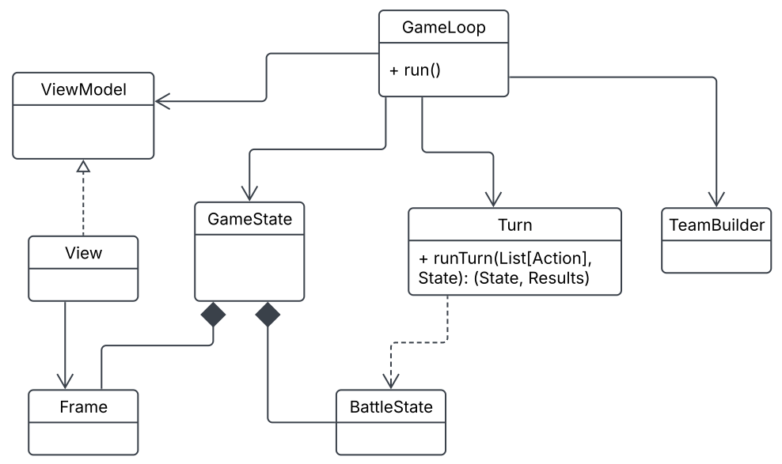
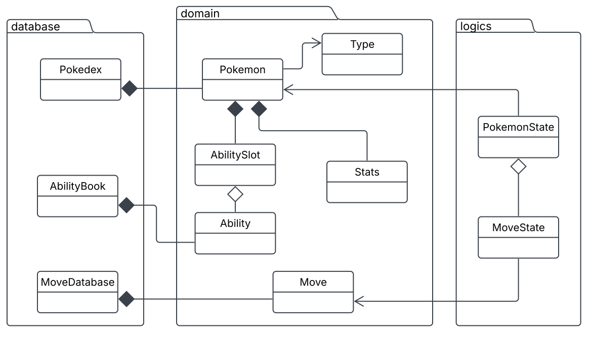
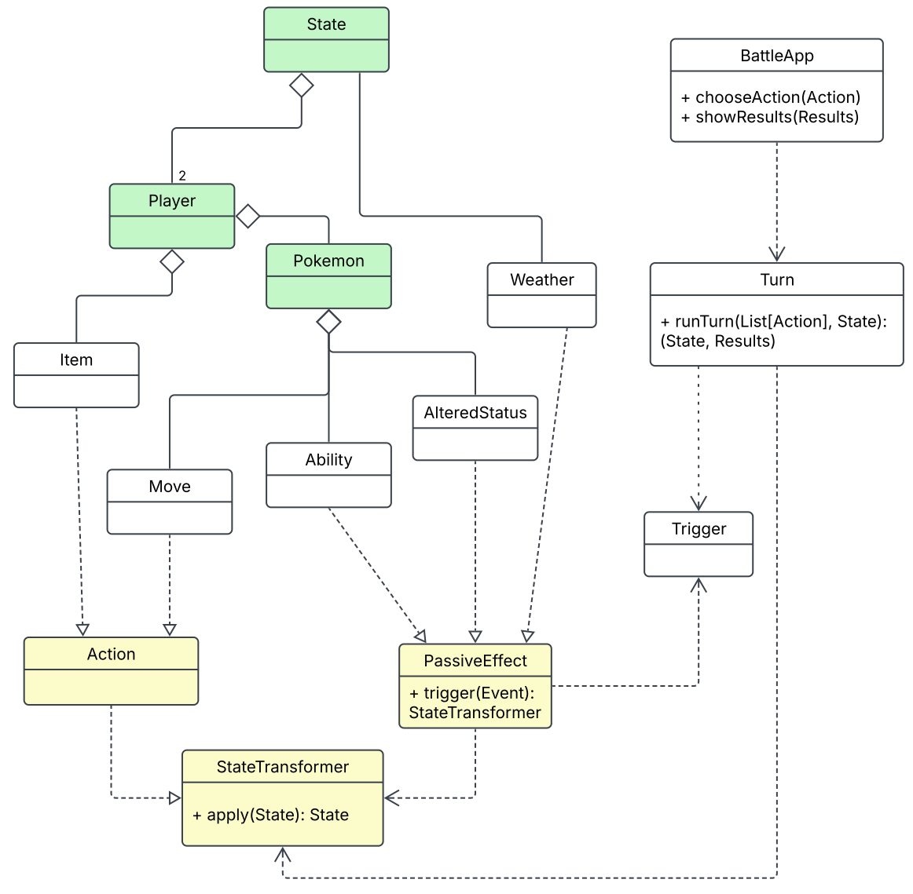

# Design architetturale
Scalamon adotta una divisione Model-View-Controller, scelta per garantire che le regole di gioco restino indipendenti dalla tecnologia di interfaccia utente e testabili in isolamento. Essendo Scalamon un progetto incentrato sulla programmazione funzionale, si
è voluto isolare il più possibile la logica di dominio, pura e priva di side effect, da quella che riguarda l'interazione con l'utente, che per natura richiede I/O e stato mutabile a livello di presentazione.

La View è realizzata secondo il pattern Ports & Adapters: il trait ViewModel funge da
port astratto, con un tipo di stato opaco V che nasconde al Controller i dettagli
implementativi della tecnologia scelta per la UI, View ne realizza l’implementazione.
Questa scelta permette di sostituire l'interfaccia grafica con una a terminale
modificando solo l'adapter (l'implementazione specifica del tipo opaco V), senza alcun impatto su GameLoop o sulla logica di dominio.

Il Controller, realizzato da `GameLoop`, orchestra l'intero ciclo di gioco (setup, team-building, game loop a turni) traducendo l'input raccolto dalla View in azioni del model (`BattleAction`). Il controller inoltre aggiorna uno stato bi-componente, costituito dal `BattleState` (usato per la logica) e l’adapter, implementato come Frame Swing.

Il Model è distribuito su due livelli: `domain` contiene le entità statiche e immutabili del gioco (Pokémon, mosse, abilità, tipi elementali), mentre `logics` definisce lo stato
dinamico della battaglia e le regole che lo evolvono. Tale suddivisione, che si riflette anche nell’organizzazione dei package, si occupa di separare "cosa esiste nel gioco" da "come il gioco evolve", permettendo di modificare le regole di combattimento, senza toccare la definizione delle entità, e viceversa.

Il diagramma mostra come questi tre ruoli si compongono. `GameLoop` è l'unico componente che ha la visione completa del sistema: dal lato dell'interfaccia utente dialoga esclusivamente con il port `ViewModel`, di cui `View` è l'implementazione concreta, che a sua volta governa il `Frame` Swing; dal punto di vista del model invece, delega la
costruzione dello stato iniziale al `TeamBuilder` e la risoluzione di ogni turno a `Turn`.
Il Controller consegna a `Turn` le azioni scelte dai due giocatori all'inizio del turno, insieme allo stato corrente, per ricevere lo stato aggiornato e i risultati del turno. Il `GameState` su cui il `GameLoop` opera, è la coppia dei due stati che evolvono durante la partita: il `BattleState` e lo stato del `Frame`. Aggregarli in un unico valore consente al loop di rimanere funzionale, trattando l'intera partita come una successione di stati, ma mantenendo le due metà ignare l'una dell'altra.

## Organizzazione del Model

Il model è organizzato in tre package con le dipendenze visibili nel diagramma.
Il package `domain` definisce le entità statiche del gioco: il Pokémon con il proprio tipo, le statistiche di base e lo slot delle abilità, le mosse e le abilità stesse. Sono descrizioni immutabili di ciò che può esistere, che incapsulano al loro interno le gerarchie delle diverse specializzazioni e le dinamiche comuni.

Il package `database` contiene i cataloghi che enumerano le istanze concrete di queste entità: il `Pokedex` aggrega i Pokémon disponibili, l'`AbilityBook` le abilità e il `MoveDatabase` le mosse. La separazione tra definizione e catalogo rende i database il
punto di estensione dei contenuti: aggiungere un Pokémon o una mossa significa arricchire un catalogo, senza toccare né le entità né le regole.

Il package `logics` ospita le controparti dinamiche: ad esempio `PokemonState` rappresenta il Pokémon in combattimento con l'insieme delle mosse assegnate all'inizio di una partita; contiene i valori che evolvono durante la battaglia e mantiene un riferimento all'entità di dominio, la quale contiene i dati immutabili riguardanti la specie.
La distinzione tra specie e istanza in battaglia separa i dati consultati (informazioni statiche) da quelli trasformati (informazioni dinamiche): le regole di combattimento evolvono lo stato in `logics` leggendo le definizioni contenute in `domain`, senza mai modificarle.

## La simulazione del turno

Lo **stato** (colorato di verde) è una composizione gerarchica: `State` contiene i due `Player` e la condizione `Weather` corrente; ogni giocatore possiede i propri `Pokemon` e i propri `Item`; ogni Pokémon aggrega mosse, abilità ed eventuali status alterati. È il valore che descrive integralmente la battaglia in un dato istante, ed è ciò che `Turn` riceve e restituisce.

I **contratti** (colorati in giallo) sono l'idea centrale della vista. `StateTransformer` è il denominatore comune di ogni effetto di gioco: una trasformazione pura dello stato completo. Gli elementi di gioco vi si riconducono in due modi distinti: 
- `Action`: la scelta di un giocatore per il turno (come mosse e strumenti), che estende una trasformazione diretta da eseguire.
- `PassiveEffect`: una funzione che, dato un evento del turno, restituisce la trasformazione con cui reagirvi.

`Turn` riceve le azioni e lo stato, ne determina l'ordine di esecuzione, raccoglie le trasformazioni causate dagli effetti attivi/passivi e applica l'intera sequenza allo stato.
Il risultato è il nuovo stato, con l'aggiunta dei `Results`: l'esito del turno (partita ancora in corso, cambio obbligato a seguito di KO, vittoria) e il resoconto degli eventi accaduti, destinato alla presentazione.
Questo schema reattivo consente di introdurre nuove abilità senza modificare la sequenza di risoluzione: l'esecutore emette eventi e gli effetti decidono se e come reagire.

Nel diagramma la parte applicativa compare come `BattleApp`, ovvero
l'astrazione di ciò che permette l'esecuzione di un singolo turno (scelta delle azioni e consumo dei risultati). L'esecuzione del turno è indipendente rispetto al loop di gioco e proprio per questo può essere testata e verificata in isolamento.