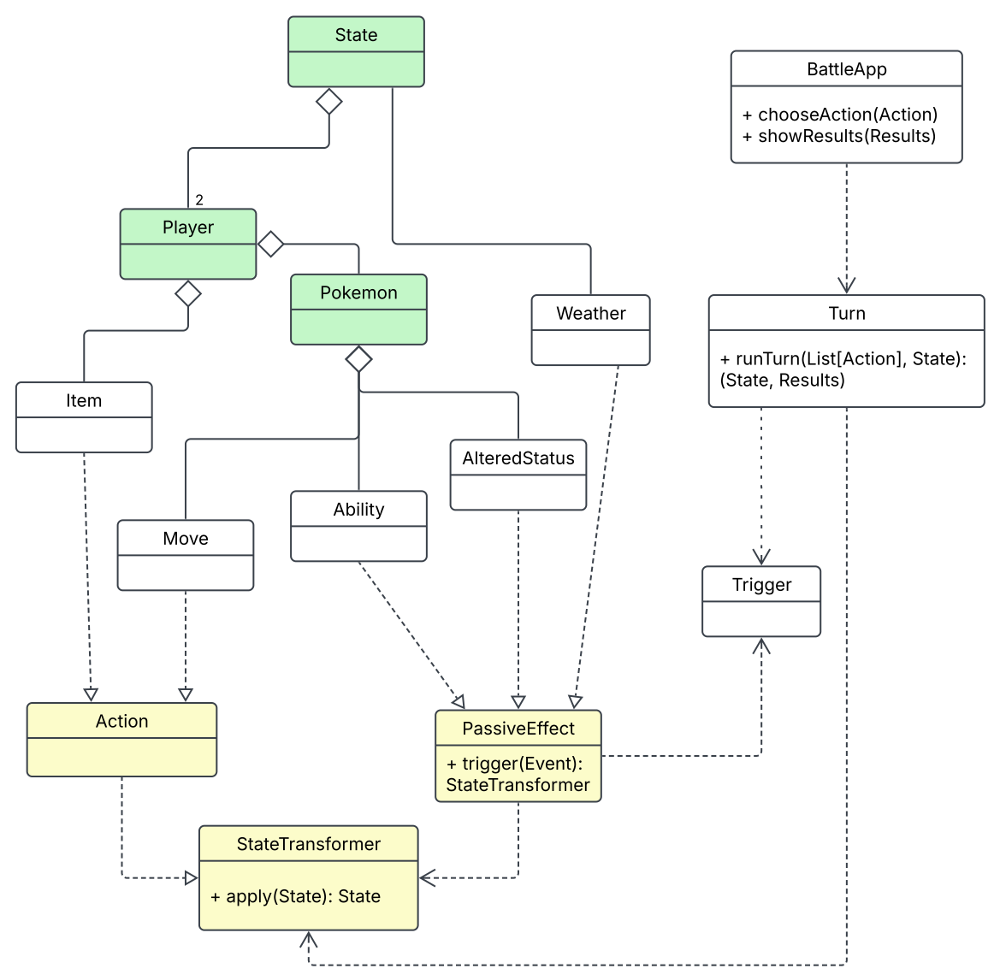

# Design architetturale

## Visione d'insieme

Scalamon è un'applicazione **monolitica a processo singolo** sulla JVM: la modalità di gioco è
l'hot-seat locale (due giocatori sulla stessa macchina), quindi il sistema non comprende componenti
distribuiti, servizi di rete né persistenza. Le scelte architetturali si concentrano perciò sulla
struttura interna, governata da due pattern sovrapposti.

Il primo è un'**architettura a strati con regola delle dipendenze**: le dipendenze fluiscono in
un'unica direzione, dall'alto verso il dominio. Il dominio non conosce la logica di gioco, la
logica non conosce l'applicazione, l'applicazione non conosce l'interfaccia concreta. Il secondo è
**Ports & Adapters** sul confine con l'utente: l'applicazione dichiara una porta astratta
(`GameView`) e l'interfaccia Swing è un adapter che la implementa; è l'unica dipendenza che
"risale" gli strati, ed è mediata da un contratto. La combinazione produce lo schema *functional
core, imperative shell*: dominio, logica e applicazione sono interamente funzioni pure su valori
immutabili, mentre gli effetti (rendering, input, dialoghi) sono confinati nel guscio Swing.

*(Figura 1: diagramma dei componenti; Figura 2: dati scambiati in un turno.)*

## Componenti del sistema

**Main** (`scalamon`) è il composition root: l'unico punto in cui applicazione e interfaccia
concreta si incontrano. Istanzia l'adapter `SwingGameView`, lo inietta in `GameApp` e avvia la
partita. Non scambia dati: fa solo cablaggio, ed è l'unica riga da cambiare per sostituire
l'interfaccia.

**GameApp** (`scalamon.app`) è il cuore applicativo: coordina il setup (difficoltà, modalità), il
team building e il game loop ricorsivo della partita. Dialoga con tre interlocutori. Verso la porta
`GameView` invia view model e richieste di input, ricevendo indietro le scelte dell'utente. Verso
il team building consegna le strategie di costruzione e riceve lo stato iniziale della battaglia.
Verso l'orchestratore invia, ad ogni turno, lo stato corrente e la coppia di azioni scelte
(`TurnChoices`), ricevendo l'esito (`TurnResult`) e il nuovo `BattleState`.

**GameView** (`scalamon.app`) è la porta verso l'interfaccia utente: un trait con tipo di stato
astratto `V` che definisce il contratto di ogni interazione. I dati che lo attraversano sono
volutamente semplici e privi di markup: verso la vista viaggiano DTO di presentazione —
`BattleViewModel` (status, meteo, log del turno, mosse con i PP) e `ActionPrompt` (mosse
disponibili, panchina utilizzabile, strumenti) — oltre a messaggi testuali; dalla vista tornano
enumerazioni di setup (`Difficulty`, `Mode`), l'intenzione del giocatore (`PlayerIntent`: attacco,
cambio o uso di strumento, identificati per nome) e i selettori interattivi per il team building
manuale.

**Presenter** (`scalamon.app`) traduce il `BattleState` in rappresentazioni testuali neutre
(stringhe di stato, log iniziale, slot delle mosse). Tiene la formattazione fuori sia dal dominio
sia dalla vista: quest'ultima riceve testo già pronto e vi aggiunge solo i dettagli propri della
tecnologia (es. markup HTML dei tooltip).

**SwingGameView** (`scalamon.view`) è l'adapter che implementa la porta: costruisce le schermate di
setup, selezione e battaglia, gestisce i dialoghi modali e converte gli eventi grezzi dei widget in
`PlayerIntent`. Per il team building fornisce i tre selettori come funzioni differite che, quando
invocate, eseguono le schermate interattive di scelta.

**SwingFacade** (`scalamon.view`) incapsula Scala Swing dietro un'interfaccia a widget nominati
(bottoni, etichette, aree di testo). Con `SwingGameView` scambia in ingresso comandi di
costruzione e aggiornamento dei widget e in uscita eventi come semplici stringhe (il nome del
widget premuto), tramite una coda bloccante che disaccoppia il thread degli eventi Swing dal game
loop.

**BattleOrchestrator** (`scalamon.logics.turns`) è il motore del turno: riceve stato, scelte dei
giocatori e criterio di velocità, calcola l'ordine di esecuzione (priorità, poi velocità),
concatena le trasformazioni delle tre fasi del turno e le applica in sequenza, restituendo
`TurnResult` (partita in corso, cambio forzato con i candidati, vittoria) e il nuovo stato. Il
modulo comprende anche `BattleSetup`, che dai due `TeamBuilder` produce il `BattleState` iniziale.

**TeamBuilder** (`scalamon.logics.teambuilder`) costruisce i `PlayerState` dei due giocatori: riceve
le strategie di selezione (funzioni), consulta i database del dominio (Pokédex, mosse, strumenti) e
garantisce gli invarianti di composizione, restituendo stati di gioco validi per costruzione.

**Moduli di stato** (`scalamon.logics.state`) definiscono il `BattleState` immutabile, la sua
gerarchia di componenti e i combinatori con cui ogni effetto di gioco è espresso come
`StateTransformer`; lo stato trasporta anche il logger degli eventi del turno. È il vocabolario
comune usato dall'orchestratore e da tutti gli effetti del dominio.

**Dominio** (`scalamon.domain`) contiene i dati statici e le regole pure del gioco: Pokédex, database
delle mosse, libro delle abilità, strumenti, tabella dei tipi e condizioni meteo, in gran parte
espressi tramite piccoli DSL dichiarativi. È consultato in sola lettura dalla logica (e, per i
tooltip informativi, dalla vista) e non dipende da nessun altro componente.

**StateMonad** (`scalamon.util`) è l'infrastruttura funzionale condivisa, priva di dipendenze: il
tipo `StateMonad[S, A]` con i suoi combinatori, usato da applicazione e vista per comporre le
computazioni con stato.

## Interazioni e dati scambiati in un turno

La Figura 2 riassume il percorso dei dati in una iterazione del game loop. All'andata: il click
dell'utente diventa un evento-stringa nella coda della `SwingFacade`; `SwingGameView` lo interpreta
(eventualmente aprendo menù di scelta) e lo eleva a `PlayerIntent`; `GameApp` lo traduce in
`BattleAction` di dominio e, raccolte le azioni di entrambi i giocatori, compone una `TurnChoices`.
Al ritorno: l'orchestratore restituisce `TurnResult` e nuovo `BattleState`; il `Presenter` ne
estrae un `BattleViewModel` testuale; la vista aggiorna i widget e il log. Ogni attraversamento di
confine cambia il livello di astrazione del dato — stringa grezza, intenzione, azione di dominio,
stato, view model — ed è questo a mantenere i componenti sostituibili.

## Scelte tecnologiche cruciali

**Scala 3** non è solo il linguaggio di implementazione ma un abilitatore architetturale: extension
methods e metodi infix rendono possibili i DSL dichiarativi del dominio, gli opaque types
incapsulano rappresentazione e invarianti dei tipi di valore (statistiche, accuratezza, PP,
identificatori), i type members astratti realizzano la modularità dello stato e il tipo opaco `V`
della porta, i parametri contestuali (`given`/`using`) iniettano le politiche configurabili
(difficoltà, sistema meteo, generatore di probabilità) senza accoppiamento esplicito.

**Scala Swing con facade e coda bloccante degli eventi** è la scelta che rende compatibile una GUI
intrinsecamente event-driven con un game loop funzionale sincrono: i listener dei widget si
limitano a depositare il nome dell'evento in una `LinkedBlockingQueue`, e il loop lo preleva con
una lettura bloccante (`nextEvent`). Il modello a callback viene così invertito in un modello pull,
e l'intera applicazione può restare scritta come sequenza di computazioni monadiche.

**Nessuna libreria funzionale esterna**: la State monad è autoprodotta in poche decine di righe. La
scelta mantiene il controllo didattico sul meccanismo e azzera le dipendenze, a fronte della
rinuncia a ottimizzazioni (es. stack-safety tramite trampolining) non necessarie per la scala del
progetto.

**Assenza di componenti distribuiti, per scelta e non per vincolo**: il turno è una funzione pura
`(BattleState, TurnChoices) => (TurnResult, BattleState)` e l'interfaccia è dietro una porta con
DTO serializzabili; un'eventuale evoluzione multiplayer in rete si ridurrebbe ad aggiungere un
adapter remoto della porta e a trasportare `TurnChoices` e view model, senza toccare il core.

### Organizzazione del codice
I quattro meccanismi si riflettono direttamente nella struttura a package presentata nell'architettura:
`domain` contiene i dati puri e le definizioni dichiarative
(Pokédex, mosse, abilità, oggetti, tabella dei tipi, spesso espressi tramite piccoli DSL interni);
`logics` contiene lo stato immutabile con i suoi moduli e combinatori, il team building e l'orchestrazione
dei turni; `app` contiene il game loop monadico e la porta `GameView`;
`view` contiene l'adapter Swing; `util` la State monad, priva di dipendenze.
Le dipendenze fluiscono in un'unica direzione, verso il dominio, e l'unico attraversamento in senso opposto
è l'implementazione della porta da parte della vista.

