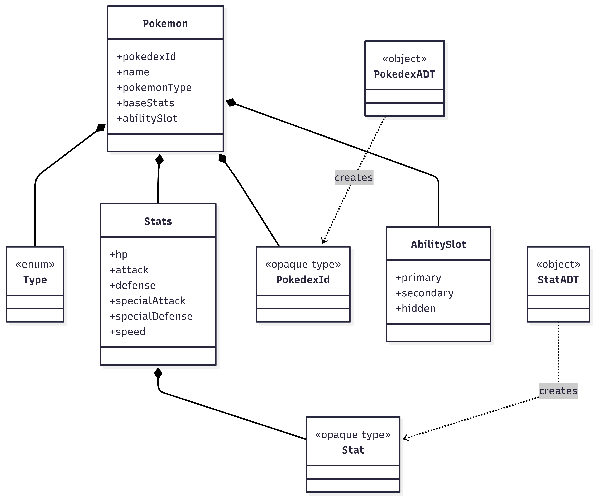
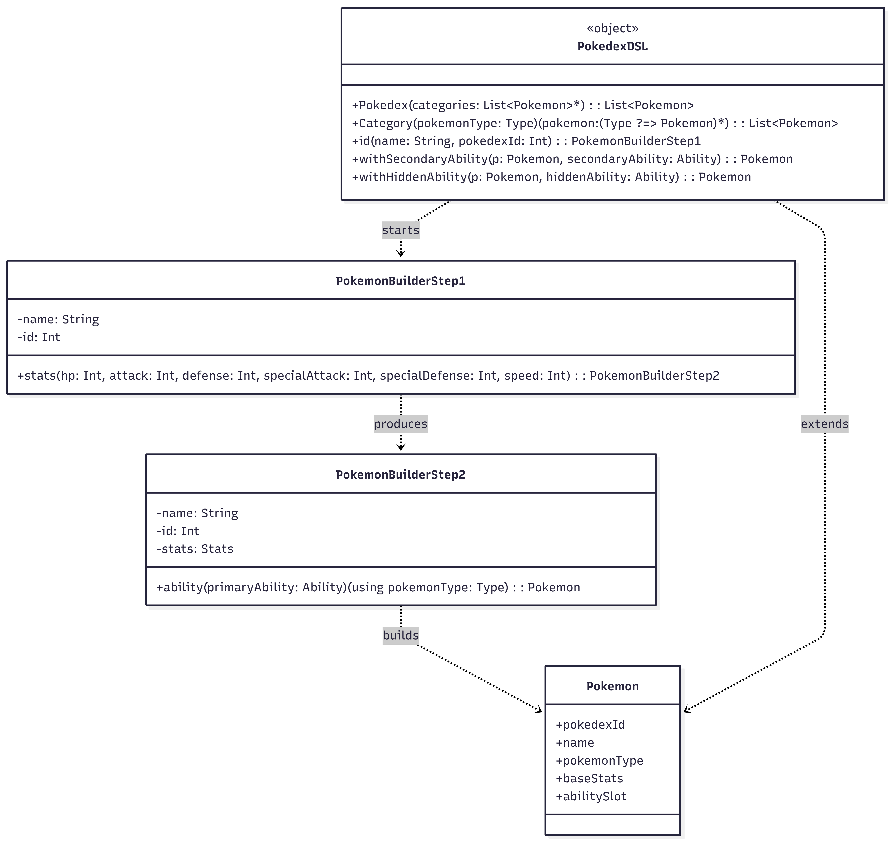
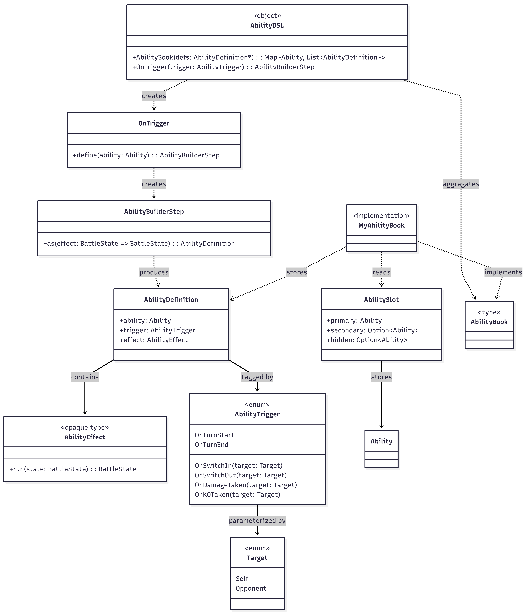
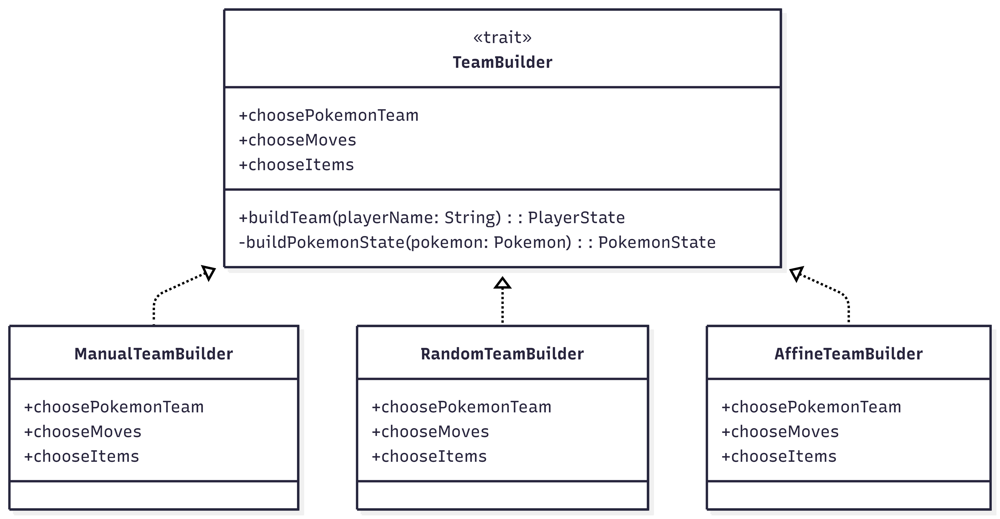
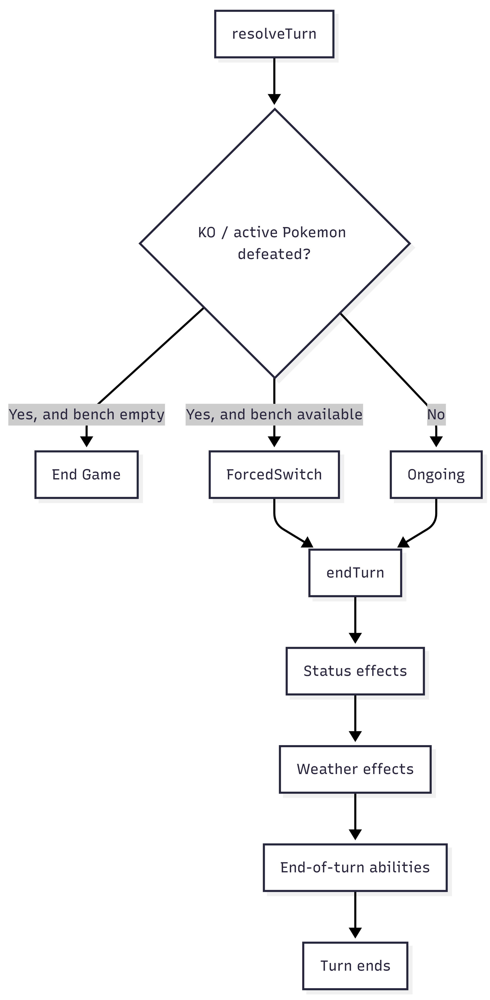

# Federico Brighi

## Panoramica del contributo
Per quanto riguarda il mio contributo in questo progetto, oltre a svolgere il ruolo di **Product Owner**, mi sono occupato di progettatare e implementare i moduli relativi alla completa entità statica dei Pokémon, al sistema di abilità passive, alle statistiche, al team builder manuale, alla politica del calcolo del danno e alla risoluzione dei turni. Tutte queste sezioni sono state sviluppate sfruttando principalmente tipi opachi, DSL fluenti, pattern matching, trasformatori di stato puri e diversi design pattern classici incontrati durante il corso riletti in chiave funzionale (tra cui Builder, Factory, Strategy, Template Method, Adapter). Uno dei miei principali obiettivi architetturali è stato quello di mantenere una netta separazione tra il modello statico e immutabile del Pokémon e il suo stato dinamico durante il combattimento, gestito invece nei moduli implementati da Pasini.

## Modello statico del Pokémon
Ho modellato la classe **Pokémon** come case class immutabile, rappresentante l'entità statica di un Pokémon, separata nettamente dal suo stato dinamico di combattimento. La validazione di dominio è applicata direttamente tramite i require nel costruttore: il nome non può essere vuoto e il tipo non può essere Normal.
Le **statistiche di base** del pokémon sono modelllate tramite il tipo opaco Stat (definito in StatADT), che nasconde la rappresentazione come numero intero richiedendo un valore strettamente positivo. Analogamente, Pokédex è un tipo opaco (definito in PokedexADT) che garantisce che ogni identificativo sia un intero positivo, con la relativa factory PokedexADT.fromInt, responsabile della validazione tramite require. Questo utilizzo degli opaque types di Scala realizza la logica degli Abstract Data Type: è il modulo a esportare il tipo e le sue operazioni, nascondendo completamente la rappresentazione concreta.È impossibile, ad esempio, passare accidentalmente un Int negativo come PokedexId senza una conversione esplicita che ne validi il valore.

```scala
object PokedexADT:
  opaque type PokedexId = Int
  def fromInt(id: Int): PokedexId =
    require(id > 0, "Pokedex ID must be a positive integer")
    id
```

L'accesso ai valori sottostanti di Stat e PokedexId avviene esclusivamente tramite extension methods, che espongono le rappresentazioni numeriche senza mai permettere una manipolazione diretta dei valori interni, in modo analogo a quanto fatto per i tipi Accuracy, Power e PP progettati da Paggetti per il sottosistema delle mosse.
La composizione dell'entità Pokemon riunisce quindi quattro elementi indipendenti: l'identificativo PokedexId, il blocco di sei Stat racchiusi in Stats, il tipo elementale Type e l'AbilitySlot, ciascuno responsabile della propria validazione di dominio.
Il diagramma seguente illustra le relazioni di composizione tra Pokemon, Stats, Stat, PokedexId e AbilitySlot, evidenziando anche i moduli factory PokedexADT e StatADT che ne garantiscono la validità.



## DSL per il Pokédex

Il PokedexDSL implementa un Builder a due step per l’istanziazione dei Pokémon: ogni fase espone soltanto l’operazione successiva, guidando il programmatore nella costruzione corretta tramite metodi infix concatenati. In particolare, partendo con nome e identificativo si accede prima allo step che consente di specificare le statistiche di base e successivamente allo step che permette di associare l’abilità primaria, ottenendo così un’istanza valida di Pokemon.

La funzione Category sfrutta inoltre i context parameters, nella forma `using pokemonType: Type`, per iniettare implicitamente il tipo elementale in tutti i Pokémon definiti all’interno dello stesso blocco, eliminando ripetizioni e rendendo la definizione del Pokédex più leggibile e dichiarativa. Una volta costruito il Pokémon con la sola abilità primaria, il DSL mette poi a disposizione due extension methods withSecondaryAbility e withHiddenAbility, che permettono di arricchire l’istanza in modo fluente senza modificarla.

Questo meccanismo può essere visto come una rilettura funzionale del pattern Adapter/Decorator: ogni chiamata restituisce infatti una nuova istanza immutabile decorata con l’informazione aggiuntiva, preservando l’oggetto originale. Il vincolo di mutua esclusione tra abilità secondaria e abilità nascosta è comunque imposto nel costruttore di AbilitySlot tramite require, così da garantire che l’invariante di dominio non possa essere violato neppure in caso di istanziazione diretta, al di fuori del DSL.

```scala
private [pokedex] case class PokemonBuilderStep1(name: String, id: Int):
  infix def stats(hp: Int, attack: Int, defense: Int, specialAttack: Int, specialDefense: Int, speed: Int): PokemonBuilderStep2 =
    val s = Stats(
      fromInt(hp),
      fromInt(attack),
      fromInt(defense),
      fromInt(specialAttack),
      fromInt(specialDefense),
      fromInt(speed)
    )
    PokemonBuilderStep2(name, id, s)


  case class PokemonBuilderStep2(name: String, id: Int, stats: Stats):
    infix def ability(primaryAbility: Ability)(using pokemonType: Type): Pokemon =
      Pokemon(
        pokedexId = PokedexADT.fromInt(id),
        name = name,
        pokemonType = pokemonType,
        baseStats = stats,
        abilitySlot = AbilitySlot(primaryAbility)
      )
      
  extension (p: Pokemon)

    infix def withSecondaryAbility(secondaryAbility: Ability): Pokemon =
      p.copy(abilitySlot = p.abilitySlot.copy(secondary = Some(secondaryAbility)))

    infix def withHiddenAbility(hiddenAbility: Ability): Pokemon =
      p.copy(abilitySlot = p.abilitySlot.copy(hidden = Some(hiddenAbility)))
```

Ed ecco un esempio di come viene creato un Pokemon per essere salvato nel database Pokedex

```scala
CategoryFire(
  "Charmander" id 4 stats(39,52,43,60,50,65) ability Blaze withHiddenAbility SolarScales,
  "Charizard"  id 6 stats(78,84,78,109,85,100) ability SolarPower withHiddenAbility Drought,
)
```

Il diagramma seguente mostra il flusso completo del builder, mostrando i due Step di costruzione per ottenere un Pokemon valido, con anche le estensioni per aggiungere abilità secondarie o nascoste.



## Sistema di Abilità passive

Il **sistema di abilità** è stato il mio contributo più articolato per questo progetto: **AbilityEffect** è un opaque type che incapsula una funzione BattleState => BattleState, esponendo solo il metodo run tramite extension method: ogni **abilità** è rappresentata come un'azione incapsulata ed eseguibile in un momento successivo, senza esporre l'implementazione della trasformazione.

L'**AbilityDSL** fornisce un Builder a due step, analogo a quello del Pokédex, per definire le abilità in modo dichiarativo:
`OnTrigger(trigger) define ability as effect` usa infix def per rendere la definizione leggibile come linguaggio naturale.

L'**AbilityBook** raggruppa le definizioni in una Map[Ability, List[AbilityDefinition]] tramite groupBy, realizzando di fatto una Registry di comandi indicizzati ognuno con il proprio trigger. Come si può notare, nel database concreto delle abilità, **MyAbilityBook**, sono contenute oltre trenta definizioni distinte organizzate in base categoria elementale dei Pokemon di appartenenza (Fire, Water, Grass, Electric, Psychic, Poison), ciascuna delle quali sfrutta funzioni ausiliarie private come healSelf, damageSelf e reduceOpponentAttack per evitare duplicazione di codice tra abilità con logica simile.

``` scala
OnTrigger(OnTurnEnd) define RainDish as { state =>
    if state.weather == Weather.Rain then healSelf(30)(state) else state
}
```
I **Trigger** (contenuti in **AbilityTrigger**) sono una enum che copre tutti i momenti rilevanti del combattimento (OnTurnStart, OnTurnEnd, OnSwitchIn, OnSwitchOut, OnDamageTaken, OnKOTaken), parametrizzati con il target (Self o Opponent). Così il sistema va a realizzare il pattern Observer: ogni ability si registra implicitamente su un trigger e viene notificata/eseguita quando quell'esatto evento si verifica durante il turno. Il metodo runTrigger in MyAbilityBook filtra le definizioni per trigger e applica gli effetti sequenzialmente tramite foldLeft:

``` scala
def runTrigger(trigger: AbilityTrigger, slot: AbilitySlot)(state: BattleState): BattleState =
    allSlots(slot)
        .flatMap(lookupByTrigger(_, trigger))
        .foldLeft(state)((s, define) => define.effect.run(s))
```

La funzione ausiliaria privata `allSlots` invece estrae tutte le abilità effettivamente possedute dal Pokémon (primaria, secondaria ed eventualmente nascosta) tramite `List(Some(slot.primary), slot.secondary, slot.hidden).flatten`, mentre `lookupByTrigger` interroga il registro filtrando per il trigger selezionato.
Un aspetto rilevante è che il chiamante è sempre responsabile di orientare correttamente lo stato prima di invocare runTrigger (ad esempio scambiando self e opponent quando il trigger riguarda l'avversario) mantenendo così il modulo agnostico rispetto a quale dei due giocatori sia effettivamente coinvolto.

**AbilityDamageModifier** separa i modificatori di danno basati sulle abilità (come Blaze, ThickFat, Guts) dalla trasformazione del battle state: restituisce un **DamageModifierResult** con moltiplicatore e log, composto tramite prodotto dei moltiplicatori e concatenazione dei log con la funzione privata combine. Questa separazione tra "calcolo del modificatore" e "applicazione dell'effetto" è un'applicazione del principio Strategy: ogni abilità rappresenta una strategia di calcolo intercambiabile, selezionata dinamicamente tramite pattern matching sul tipo di Ability, con due varianti simmetriche (abilityAttackModifier per l'attaccante e abilityDefenseModifier per il difensore) che vengono poi composte dal DamageMoveCalculator all'interno della formula standard del danno insieme a STAB, efficacia di tipo e moltiplicatore meteorologico.

Ecco un esempio di come viene implementata una delle abilità che modificano il calcolo del danno:

``` scala
case Blaze if lowHp && move.moveType == Fire => 
    DamageModifierResult(
        1.5,
        List(s"[Blaze] ${attacker.species.name} is using Blaze! Fire moves are boosted!")
    )
```

Il diagramma seguente rappresenta la struttura statica del DSL delle abilità, con i due builder step, l'opaque type AbilityEffect e l'enum AbilityTrigger parametrizzato dal Target.



## Team builder manuale
Il `ManualTeamBuilder` estende il TeamBuilder base, **costruito in collaborazione con Paggetti**, accettando funzioni higher-order come parametri: un `PokemonSelector` (che, data la lista di tutti i Pokémon disponibili, restituisce quelli scelti), un `MoveSelector` (che, per ogni Pokémon, restituisce le mosse selezionate) e un `ItemSelector` per la scelta degli strumenti. 

Più precisamente, il TeamBuilder base realizza un Template Method in chiave funzionale: l'algoritmo generale di costruzione del team, incapsulato nel metodo buildTeam, resta fisso e indipendente dalla strategia adottata, mentre le operazioni variabili (la selezione dei Pokémon, delle mosse e degli oggetti) sono modellate non come metodi astratti da sovrascrivere, ma come function values passate al costruttore. Al posto dell'ereditarietà e dell'override, abbiamo utilizzato la composizione con funzioni, ottenendo lo stesso effetto di "algoritmo fisso, step variabili" ma con maggiore flessibilità e senza gerarchie di classi rigide.

``` scala
final def buildTeam(playerName: String): PlayerState =
    val chosenPokemonTeam = choosePokemonTeam(allPokemons, TeamSize)
    require(chosenPokemonTeam.size == TeamSize, s"Every player team must contain exactly $TeamSize Pokemon")
    val team = chosenPokemonTeam.map(p => p.name -> buildPokemonState(p)).toMap
    val items = chooseItems(allItems, ItemsPerPlayer)
    playerInitialState(playerName, team, chosenPokemonTeam.head.name, items)
```

Una volta selezionati i Pokémon, `buildTeam` verifica che il numero dei membri sia conforme ai vincoli di `GameConfig (TeamSize)`, e successivamente converte ogni Pokémon nel corrispondente `PokemonState` tramite il metodo privato `buildPokemonState`, che inizializza le mosse selezionate creando per ciascuna il relativo `MoveState` con il corretto valore iniziale dei PP. Al termine viene generato il `PlayerState`, impostando automaticamente il primo Pokémon della squadra come attivo, e l'uso di chiamate require garantisce il rispetto degli invarianti fondamentali, evitando stati di gioco inconsistenti.

``` scala
private final def buildPokemonState(pokemon: Pokemon): PokemonState =
    val chosenMoves = chooseMoves(pokemon, allMoves.toList, MovesPerPokemon)
    require(chosenMoves.size == MovesPerPokemon, s"Every Pokemon must have exactly $MovesPerPokemon moves")
    val moveStates = chosenMoves.map(m => m.name -> moveInitialState(m)).toMap
    pokemonInitialState(pokemon, moveStates)
``` 

Sopra questo scheletro comune si innestano le tre strategie concrete di selezione, che condividono la stessa interfaccia ma incapsulano algoritmi diversi (un'applicazione del principio Open-Closed, poiché il sistema resta aperto a nuove strategie di team building senza dover modificare il codice del TeamBuilder base):

``` scala
case class ManualTeamBuilder(
    choosePokemonTeam: PokemonSelector,
    chooseMoves: MoveSelector,
    chooseItems: ItemSelector
) extends TeamBuilder
```

Il diagramma seguente mostra il TeamBuilder come algoritmo base di costruzione del team e le tre implementazioni concrete come strategie intercambiabili di selezione, le quali forniscono i criteri diversi con cui scegliere Pokémon, mosse e oggetti, mentre il flusso generale rimane fisso nel trait base.



## Politica di danno e calcolo del Danno

`DamagePolicy` è un trait con un singolo metodo `multiplier: Double`, implementato come given instances per le tre difficoltà: **Easy (0.1), Medium (0.2) e Hard (0.3)**. Questo è un uso dello Strategy pattern realizzato tramite type class: la politica di danno è un algoritmo intercambiabile passato come contesto implicito, e l'uso di given/using permette di propagarla attraverso tutto il sistema di calcolo del danno senza doverla passare manualmente ad ogni chiamata. Nel livello applicativo, la scelta della difficoltà avviene in `GameApp` tramite un semplice pattern matching sull'enum Difficulty che seleziona la given instance corrispondente, rendendo la propagazione del contesto completamente trasparente al resto del motore di calcolo del danno.

Ecco la formula del danno finale, definita nei requirements, composta da vari componenti implementati in 'DamageMoveCalculator':

``` scala
 val finalDamage =
  (baseFormula * stab * typeEffectiveness * policy.multiplier *weatherMulti * criticalDamageMultiplier
    * atkResult.multiplier * defResult.multiplier).toInt
```

## Risoluzione dei turni
Questo modulo è stato fondamentale, in quanto è servita collaborazione con tutti i membri del team per raccogliere e gestire a fine turno gli effetti che ciascuno ha implementato nella propria parte. Esso definisce i possibili esiti di un turno come un ADT `TurnResult: Ongoing, Victory, ForcedSwitch, ...`.

La risoluzione avviene in modo funzionale puro: `resolveTurn` controlla la sequenza degli eventi (KO, vittoria, cambio forzato) e restituisce il `TurnResult` corretto senza effetti collaterali, seguendo il pattern Template Method in chiave funzionale: la sequenza di controlli è fissa, ma ogni singolo controllo  è una funzione pura sostituibile.
```scala
trait TurnResolutionModule:
  def isKnockedOut(pokemon: PokemonState): Boolean
  def isDefeated(player: PlayerState): Boolean
  def needsForcedSwitch(player: PlayerState): Boolean
  def getTurnResults(state: BattleState): TurnResult
  def endTurn: List[StateTransformer]

override def getTurnResults(state: BattleState): TurnResult =
  if isDefeated(state.self) then TurnResult.Victory(state.opponent.name)
  else if isDefeated(state.opponent) then TurnResult.Victory(state.self.name)
  else
    val requests = List(Side.Self, Side.Opponent).flatMap: side =>
    val player = playerOf(state, side)
    Option.when(needsForcedSwitch(player))(SwitchRequest(side, aliveBench(player)))
    if requests.isEmpty then TurnResult.Ongoing
    else TurnResult.ForcedSwitch(requests)
```

Il metodo `endTurn` compone tre categorie di effetti da applicare al termine del turno: **danni causati da stati alterati (bruciatura, veleno), effetti di abilità end-of-turn, e danni meteorologici**. Poi il metodo li applica sequenzialmente al `BattleState` tramite `foldLeft`. Qui è stato usato il pattern Composite/Pipeline: ogni categoria di effetto è una trasformazione indipendente e componibile, facilmente testabile in isolamento. 

La gestione del cambio forzato (ForcedSwitch) è separata dalla vittoria: se un Pokémon viene sconfitto ma il giocatore ha ancora Pokémon in panchina, viene richiesto un cambio obbligatorio (tramite un `SwitchRequest` gestito a livello applicativo in `handleForcedSwitch`); solo se la panchina è vuota viene decreta la sconfitta del giocatore. L'orchestrazione a livello di GameApp mostra bene questa separazione: il game loop invoca resolveTurn, verifica se il risultato è ForcedSwitch per richiedere l'input al giocatore tramite askForcedSwitch, e solo in caso di Victory termina la partita, altrimenti richiama ricorsivamente il ciclo di gioco.

```scala
private def applyStatusEffects: StateTransformer =
  forBothSides(s => s.self.getActive.status.foldLeft(s)((st, status) => status.applyCondition(st))
)

private def applyEndOfTurnAbilities: StateTransformer = forBothSides(applyPassiveEffects(OnTurnEnd))

private def applyWeatherEffects: StateTransformer = summon[WeatherEndTurnResolver].apply

override def endTurn: List[StateTransformer] = List(
  applyStatusEffects,
  applyWeatherEffects,
  applyEndOfTurnAbilities,
)
```


Il diagramma seguente riassume il ciclo di risoluzione del turno: resolveTurn determina l’esito tra Ongoing, ForcedSwitch ed End Game (che sarebbe il Victory relativo al self/opponent player), mentre endTurn applica in sequenza gli effetti residui di stato, meteo e abilità di fine turno.




