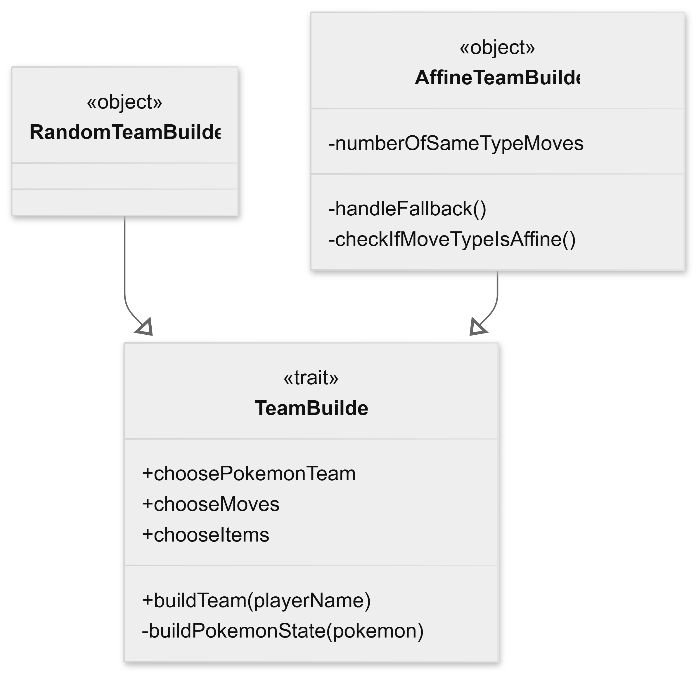
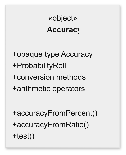
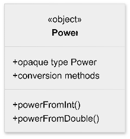
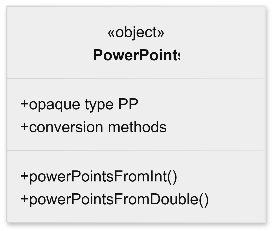
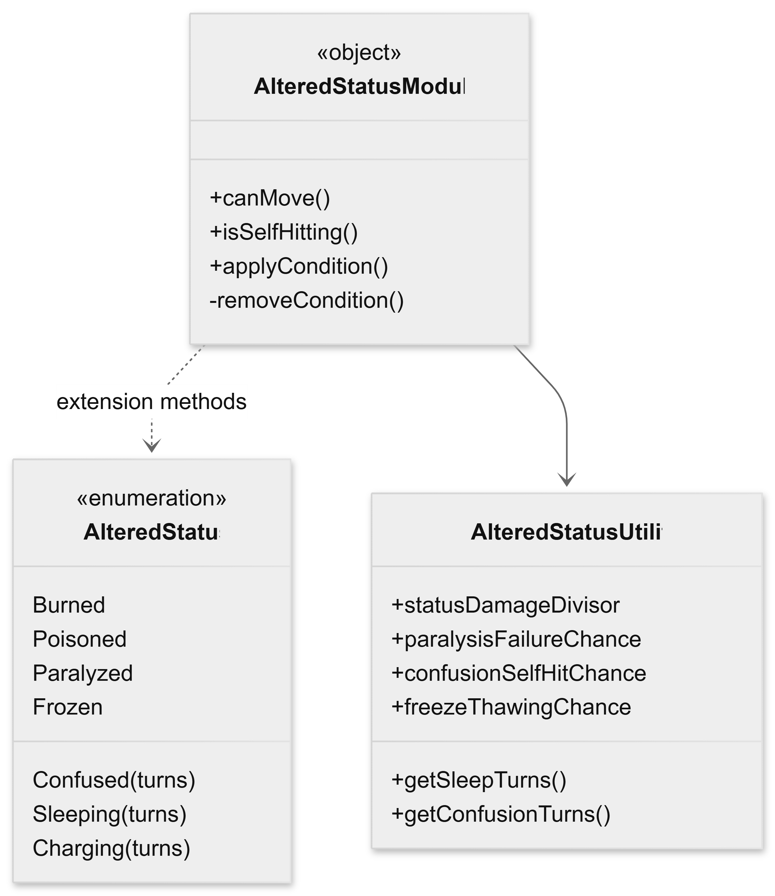

# Marco Paggetti

## Team Builder
Il sottosistema dedicato alla costruzione delle squadre ha lo scopo di generare lo stato iniziale di un giocatore, comprendente il team di Pokémon, le mosse associate a ciascun membro e gli strumenti disponibili durante la battaglia. Per ottenere una implementazione facilmente estendibile è stato adottato il *Template Method*, delegando alle implementazioni concrete esclusivamente la logica di selezione degli elementi della squadra.

Il punto di partenza del sottosistema è rappresentato dal trait `TeamBuilder`, il quale definisce l'algoritmo generale di costruzione attraverso il metodo `buildTeam`. Tale algoritmo rimane invariato indipendentemente dalla strategia utilizzata e garantisce il rispetto di tutti gli invarianti richiesti dal sistema. Le operazioni variabili dell'algoritmo sono invece rappresentate dai tre membri astratti: `choosePokemonTeam`, `chooseMoves` e `chooseItems`.

A differenza di una classica implementazione del Template Method, tali operazioni non sono modellati come metodi astratti con liste di parametri, ma come *function values*. Ogni strategia concreta fornisce quindi tre funzioni che descrivono il comportamento desiderato, mentre il trait mantiene completamente sotto il proprio controllo il processo di costruzione dello stato iniziale del giocatore.

Una volta selezionati i Pokémon, il metodo `buildTeam` verifica che il numero dei membri sia conforme ai vincoli definiti nella configurazione di gioco. Successivamente ogni Pokémon viene convertito nel corrispondente `PokemonState` tramite il metodo privato `buildPokemonState`, che inizializza le mosse selezionate, creando per ciascuna il relativo `MoveState`, comprensivo del corretto valore iniziale dei PP. Al termine della costruzione viene generato il `PlayerState`, impostando automaticamente il primo Pokémon della squadra come Pokémon attivo. L'utilizzo delle chiamate `require` consente inoltre di garantire il rispetto degli invarianti fondamentali del sottosistema, evitando la creazione di stati di gioco inconsistenti.

Il sistema prevede diverse strategie di selezione, ciascuna implementata come singleton o come case class che estendono il trait `TeamBuilder`:

### Random Team Builder:
`RandomTeamBuilder` realizza la strategia più semplice. Pokémon, mosse e strumenti vengono selezionati casualmente mediante l'algoritmo di mescolamento fornito da `scala.util.Random`. Nel caso delle mosse, la selezione avviene considerando l'intero database disponibile, senza verificare che il Pokémon sia effettivamente in grado di apprenderle. Tale scelta è stata effettuata per privilegiare la varietà delle simulazioni e semplificare il processo di generazione automatica dei team.

### Affine Team Builder:
`AffineTeamBuilder` implementa invece una strategia più sofisticata, orientata ad aumentare l'efficacia offensiva della squadra. Per ogni Pokémon vengono inizialmente selezionate, quando disponibili, fino a due mosse dello stesso tipo del Pokémon, in modo da sfruttare il bonus STAB (*Same Type Attack Bonus*). Successivamente vengono ricercate mosse di copertura offensiva, individuando tipi che risultino super efficaci contro quelli verso cui il tipo del Pokémon risulta invece poco efficace. Tale informazione non è codificata manualmente, ma viene ricavata dinamicamente interrogando la tabella di efficacia dei tipi (`TypeChart`). Il metodo `checkIfMoveTypeIsAffine` analizza infatti tutte le possibili combinazioni di tipi, verificando se il tipo della mossa può compensare una debolezza offensiva del Pokémon. Dato che il database potrebbe non contenere un numero sufficiente di mosse compatibili con tali criteri, il metodo `handleFallback` completa la selezione scegliendo casualmente le mosse mancanti. In questo modo viene sempre garantito il rispetto del numero massimo di mosse previsto dal regolamento.

## Statistiche relative alle mosse
Per rappresentare alcune delle principali caratteristiche delle mosse è stato adottato un approccio basato sugli *opaque types*, introducendo i tipi di dominio `Accuracy`, `Power` e `PP` (Power Points). Questa scelta è stata presa per evitare la *Primitive Obsession* e per evitare di modellare tali proprietà come semplici valori interni, rendendole invece concetti espliciti del dominio applicativo e riducendo il rischio di utilizzare valori non validi all'interno del sistema. Gli opaque type, rispetto a dei normali alias di tipo, risultano distinti durante la compilazione, pur essendo rappresentati internamente dal medesimo tipo sottostante (`Int`).

Per ciascun tipo è stato definito un insieme di metodi *Factory*, incaricati di verificare il rispetto dei vincoli del dominio. Ad esempio, `Accuracy` accetta esclusivamente valori compresi fra 0% e 100%, `Power` valori interi appartenenti all'intervallo (0, 250], mentre `PP` è limitato al range (0, 64]. Eventuali valori non validi vengono intercettati mediante l'utilizzo della funzione `require`, impedendo la creazione di istanze inconsistenti.

L'accesso ai valori sottostanti avviene esclusivamente tramite *extension methods*, che espongono le rappresentazioni nei diversi formati (`Int`, `Double` e `String`), senza compromettere l'incapsulamento del tipo. Questo approccio mantiene l'interfaccia pubblica essenziale e impedisce manipolazioni dirette dei valori interni.

Il tipo `Accuracy` introduce inoltre il comportamento probabilistico associato alla precisione delle mosse. Il metodo `test` determina il successo dell'azione, confrontando il valore di accuratezza con un'estrazione casuale. La generazione del numero casuale non è tuttavia effettuata direttamente dal tipo, ma viene legata a una funzione `ProbabilityRoll`, fornita tramite il meccanismo delle *Contextual Abstractions* (`given` e `using`). Tale sostituzione permette di sostituire facilmente il generatore causale durante i test automatici, rendendo il comportamento completamente deterministico, senza modificare il codice dell'implementazione. Sempre nel tipo `Accuracy`, sono stati implementati gli operatori aritmetici `+`, `-` e `*` utilizzati per applicare modificatori alla precisione delle mosse. Tutte le operazioni sfruttano una funzione interna di *clamping*, che mantiene automaticamente il valore risultante all'interno dei limiti previsti dal dominio, evitando la propagazione di valori non validi nelle successive elaborazioni.

## Altered status
Le alterazioni di stato rappresentano uno dei principali meccanismi della battaglia, influenzando sia la possibilità di eseguire una mossa, sia il comportamento del Pokémon durante i turni successivi. L'implementazione è stata progettata separando il modello dati dalla logica di elaborazione, in modo da mantenere il dominio indipendente dalle regole di gioco.

Gli stati alterati sono modellati tramite l'enumerazione `AlteredStatus`, che costituisce un *Algebri Data Type (ADT)*. Tale struttura permette di rappresentare in modo sicuro sia gli stati persistenti (`Burned`, `Poisoned`, `Paralyzed` e `Frozen`), sia quelli temporanei (`Sleeping`, `Confused` e `Charging`), per i quali viene memorizzato anche il numero di turni rimanenti. Questa scelta evita la proliferazione di classi dedicate ai singoli effetti di stato e consente di rappresentare direttamente nel tipo tutte le possibili condizioni che possono interessare un Pokémon.

L'enumerazione descrive esclusivamente i possibili stati alterati, mentre il relativo comportamento è implementato all'interno del modulo `AlteredStatusModule`. Per evitare di modificare direttamente il modello del dominio, la logica viene aggiunta mediante *extension methods*, che arricchiscono i valori di enumerazione con le operazioni necessarie alla simulazione della battaglia. Tramite gli extension method è stato infatti possibile definire il comportamento esternamente all'enumerazione, facendo rimanere il dominio indipendente rispetto alla logica della battaglia, mantenendo una buona separazione delle responsabilità.

Ogni stato acquisisce così tre comportamenti fondamentali:
- Verifica della possibilità di eseguire una mossa (`canMove`).
- determinazione dell'eventuale auto-danno dovuto alla confusione (`isSelfHitting`).
- Applicazione degli effetti ricorrenti a fine turno (`applyCondition`).

Questa soluzione mantiene il modello del dominio estremamente compatto e consente di concentrare tutte le regole di gioco in un unico modulo dedicato.

L'applicazione degli effetti di stato avviene attraverso lo `StateTransformer`, già impiegata nelle altre componenti del sistema. Il metodo `applyCondition` non modifica direttamente il `BattleState`, ma restituisce una trasformazione dello stato che verrà successivamente composta con le altre trasformazioni della pipeline di gioco. In questo modo, gli effetti di stato risultano completamente compatibili con il modello funzionale adottato dall'intero progetto, evitando modifiche distruttive dello stato della battaglia.

Le trasformazioni implementate comprendono:
- Applicazione del danno residuo per ustione e avvelenamento.
- Decremento del contatore degli stati temporanei.
- Rimozione automatica della condizione al termine della sua durata.
- Aggiornamento del log della battaglia.

L'utilizzo della funzione ausiliaria `removeCondition` evita inoltre la duplicazione del codice necessario alla rimozione degli stati temporanei.

Le condizioni di stato che prevedono eventi casuali (ad esempio paralisi, congelamento o confusione) non effettuano direttamente il lancio dei numeri casuali, ma utilizzano il `ProbabilityRoll` fornito implicitamente al modulo, la cui esecuzione viene richiamata dal metodo `test` del valore di accuratezza della mossa. Questa soluzione rende la logica indipendente dal generatore casuale utilizzato e permette di sostituire facilmente il meccanismo di estrazione durante i test automatici, ottenendo esecuzioni completamente deterministiche.

Le probabilità associate ai diversi effetti e la durata degli stati temporanei sono invece centralizzate nell'oggetto `AlteredStatusUtility`, che raccoglie sia le costanti di configurazione, sia i metodi utilizzati per generare casualmente la durata di sonno e confusione.

