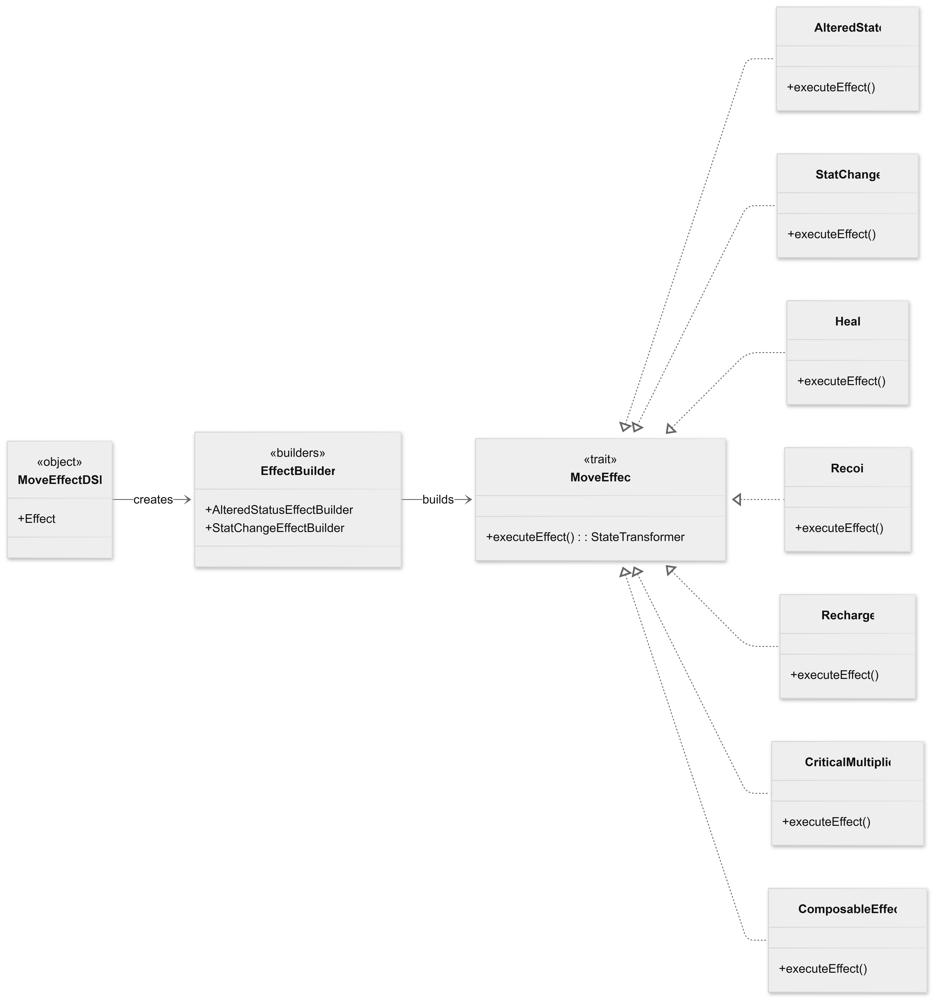
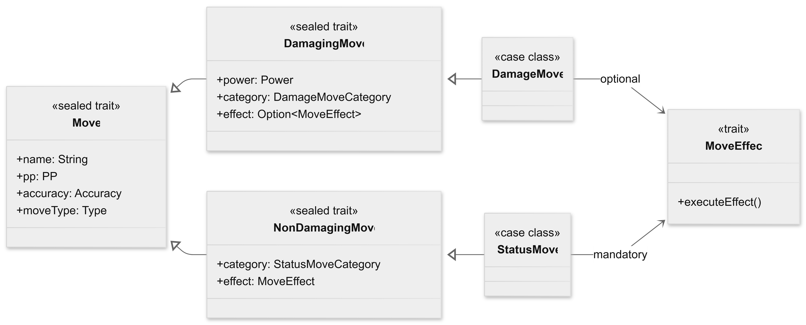
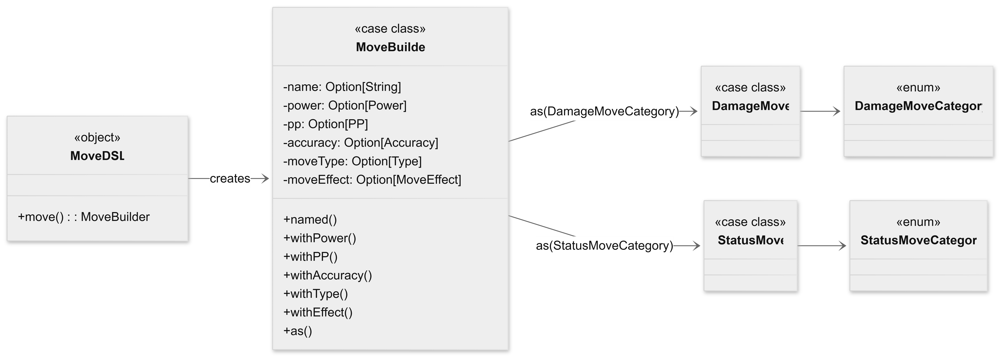
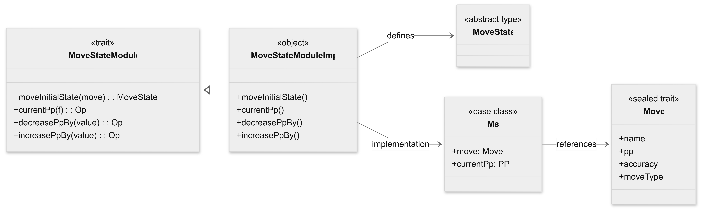
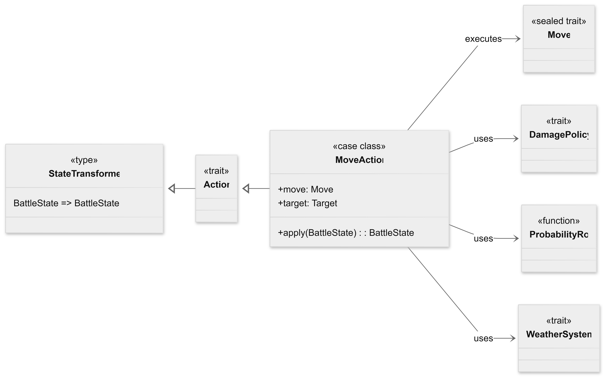

# Marco Paggetti

## Statistiche relative alle mosse
Per rappresentare alcune delle principali caratteristiche delle mosse è stato adottato un approccio basato sugli *opaque types*, introducendo i tipi di dominio `Accuracy`, `Power` e `PP` (Power Points). Questa scelta è stata presa per evitare la *Primitive Obsession* e per evitare di modellare tali proprietà come semplici valori interni, rendendole invece concetti espliciti del dominio applicativo e riducendo il rischio di utilizzare valori non validi all'interno del sistema. Gli opaque type, rispetto a dei normali alias di tipo, risultano distinti durante la compilazione, pur essendo rappresentati internamente dal medesimo tipo sottostante (`Int`).

Per ciascun tipo è stato definito un insieme di metodi *Factory*, incaricati di verificare il rispetto dei vincoli del dominio. Ad esempio, `Accuracy` accetta esclusivamente valori compresi fra 0% e 100%, `Power` valori interi appartenenti all'intervallo (0, 250], mentre `PP` è limitato al range (0, 64]. Eventuali valori non validi vengono intercettati mediante l'utilizzo della funzione `require`, impedendo la creazione di istanze inconsistenti.

L'accesso ai valori sottostanti avviene esclusivamente tramite *extension methods*, che espongono le rappresentazioni nei diversi formati (`Int`, `Double` e `String`), senza compromettere l'incapsulamento del tipo. Questo approccio mantiene l'interfaccia pubblica essenziale e impedisce manipolazioni dirette dei valori interni.

Il tipo `Accuracy` introduce inoltre il comportamento probabilistico associato alla precisione delle mosse. Il metodo `test` determina il successo dell'azione, confrontando il valore di accuratezza con un'estrazione casuale. La generazione del numero casuale non è tuttavia effettuata direttamente dal tipo, ma viene legata a una funzione `ProbabilityRoll`, fornita tramite il meccanismo delle *Contextual Abstractions* (`given` e `using`). Tale sostituzione permette di sostituire facilmente il generatore causale durante i test automatici, rendendo il comportamento completamente deterministico, senza modificare il codice dell'implementazione. Sempre nel tipo `Accuracy`, sono stati implementati gli operatori aritmetici `+`, `-` e `*` utilizzati per applicare modificatori alla precisione delle mosse. Tutte le operazioni sfruttano una funzione interna di *clamping*, che mantiene automaticamente il valore risultante all'interno dei limiti previsti dal dominio, evitando la propagazione di valori non validi nelle successive elaborazioni.

## Altered status
Le alterazioni di stato rappresentano uno dei principali meccanismi della battaglia, influenzando sia la possibilità di eseguire una mossa, sia il comportamento del Pokémon durante i turni successivi. L'implementazione è stata progettata separando il modello dati dalla logica di elaborazione, in modo da mantenere il dominio indipendente dalle regole di gioco.

Gli stati alterati sono modellati tramite l'enumerazione `AlteredStatus`, che costituisce un *Algebri Data Type (ADT)*. Tale struttura permette di rappresentare in modo sicuro sia gli stati persistenti (`Burned`, `Poisoned`, `Paralyzed` e `Frozen`), sia quelli temporanei (`Sleeping`, `Confused` e `Charging`), per i quali viene memorizzato anche il numero di turni rimanenti. Questa scelta evita la proliferazione di classi dedicate ai singoli effetti di stato e consente di rappresentare direttamente nel tipo tutte le possibili condizioni che possono interessare un Pokémon.

L'enumerazione descrive esclusivamente i possibili stati alterati, mentre il relativo comportamento è implementato all'interno del modulo `AlteredStatusModule`. Per evitare di modificare direttamente il modello del dominio, la logica viene aggiunta mediante *extension methods*, che arricchiscono i valori di enumerazione con le operazioni necessarie alla simulazione della battaglia. Tramite gli extension method è stato infatti possibile definire il comportamento esternamente all'enumerazione, facendo rimanere il dominio indipendente rispetto alla logica della battaglia, mantenendo una buona separazione delle responsabilità.

Ogni stato acquisisce così tre comportamenti fondamentali:
- Verifica della possibilità di eseguire una mossa (`canMove`).
- determinazione dell'eventuale auto-danno dovuto alla confusione (`isSelfHitting`).
- Applicazione degli effetti ricorrenti a fine turno (`applyCondition`).

Questa soluzione mantiene il modello del dominio estremamente compatto e consente di concentrare tutte le regole di gioco in un unico modulo dedicato.

L'applicazione degli effetti di stato avviene attraverso lo `StateTransformer`, già impiegata nelle altre componenti del sistema. Il metodo `applyCondition` non modifica direttamente il `BattleState`, ma restituisce una trasformazione dello stato che verrà successivamente composta con le altre trasformazioni della pipeline di gioco. In questo modo, gli effetti di stato risultano completamente compatibili con il modello funzionale adottato dall'intero progetto, evitando modifiche distruttive dello stato della battaglia.

Le trasformazioni implementate comprendono:
- Applicazione del danno residuo per ustione e avvelenamento.
- Decremento del contatore degli stati temporanei.
- Rimozione automatica della condizione al termine della sua durata.
- Aggiornamento del log della battaglia.

L'utilizzo della funzione ausiliaria `removeCondition` evita inoltre la duplicazione del codice necessario alla rimozione degli stati temporanei.

Le condizioni di stato che prevedono eventi casuali (ad esempio paralisi, congelamento o confusione) non effettuano direttamente il lancio dei numeri casuali, ma utilizzano il `ProbabilityRoll` fornito implicitamente al modulo, la cui esecuzione viene richiamata dal metodo `test` del valore di accuratezza della mossa. Questa soluzione rende la logica indipendente dal generatore casuale utilizzato e permette di sostituire facilmente il meccanismo di estrazione durante i test automatici, ottenendo esecuzioni completamente deterministiche.

Le probabilità associate ai diversi effetti e la durata degli stati temporanei sono invece centralizzate nell'oggetto `AlteredStatusUtility`, che raccoglie sia le costanti di configurazione, sia i metodi utilizzati per generare casualmente la durata di sonno e confusione.

## Effetti delle mosse
La gestione degli effetti secondari delle mosse è stata implementata attraverso un modello basato su trasformazioni dello stato della battaglia. Ogni effetto prodotto da una mossa viene rappresentato come un oggetto in grado di generare uno `StateTransformer`, ovvero una funzione pura che riceve lo stato corrente della battaglia e restituisce il nuovo stato risultante dall'applicazione dell'effetto.

Il comportamento comune è definito dal trait `MoveEffect`, che rappresenta l'astrazione base per tutti gli effetti disponibili:
- Applicazione di uno stato alterato.
- Modifica delle statistiche.
- Cura dei punti salute.
- Danno da contraccolpo.
- Applicazione dello stato di ricarica.
- Modifica della probabilità di colpo critico.
- Trasformazioni personalizzate.

Ogni implementazione concreta del trait ridefinisce il metodo `executeEffect`, restituendo la trasformazione necessaria per far evolvere il `BattleState`.

Gli effetti sono rappresentati tramite diverse `case class`, ognuna responsabile della costruzione di una specifica trasformazione dello stato. 

`AlteredState` permette di applicare una condizione alterata al Pokémon bersaglio. L'effetto riceve una funzione `statusFactory`, utilizzata per generare lo stato da applicare, e una probabilità di successo rappresentata tramite il tipo di dominio `Accuracy`. Prima di modificare lo stato, viene quindi effettuato un test probabilistico, permettendo di modellare effetti come paralisi, avvelenamento o confusione, con probabilità variabili relative all'effetto.

`StatChange` gestisce invece le modifiche temporanee alle statistiche dei Pokémon. La trasformazione riceve una funzione che modifica il relativo `StatsState` e un parametro `Target` che determina se l'effetto deve essere applicato al Pokémon utilizzatore oppure all'avversario.

Gli effetti `Heal` e `Recoil` utilizzano il valore percentuale degli HP massimi del Pokémon per calcolare dinamicamente il quantitativo di punti salute da ripristinare o sottrarre. Questa scelta permette di definire facilmente mosse con effetti proporzionali alla salute massima del Pokémon target, senza introdurre valori fissi.

L'effetto `Recharge` rappresenta invece le mosse che obbligano il Pokémon utilizzatore a trascorrere alcuni turni in stato di ricarica. Per implementarlo viene riutilizzato il sistema delle alterazioni di stato, aggiungendo una condizione `Charging` al Pokémon utilizzatore e aggiornando il log della battaglia.

Infine, `ComposableEffect` permette di incapsulare direttamente una trasformazione arbitraria dello stato. Questa classe fornisce un punto di estensione per eventuali effetti non previsti dalle implementazioni standard.

### DSL per la definizione degli effetti
Per rendere la definizione delle mosse più leggibile e vicina al linguaggio del dominio, è stato sviluppato un *DSL (Domain Specific Language)* dedicato alla costruzione degli effetti. Lo scopo è quello di nascondere i dettagli implementativi delle classi che rappresentano gli effetti, permettendo di descrivere una mossa attraverso una sintassi più espressiva e dichiarativa.

Il DSL è stato implementato all'interno dell'oggetto `MoveEffectDSL` e sfrutta gli *extension methods*, per creare una notazione simile al linguaggio naturale. 

Il punto di ingresso del DSL è rappresentato dall'oggetto interno `Effect`, che espone una serie di operazioni corrispondenti ai principali effetti disponibili nel gioco:
- `applying` per applicare uno stato alterato.
- `changing` per modificare una statistica.
- `healing` per curare il Pokémon utilizzatore.
- `recoil` per applicare danno da contraccolpo.
- `recharging` per aggiungere uno stato di ricarica.
- `multiplyingCriticalBy` per modificare il moltiplicatore del colpo critico.

Ogni operazione non crea immediatamente l'effetto finale, ma restituisce eventualmente un *Builder* intermedio, che permette di specificare ulteriori parametri necessari alla costruzione dell'oggetto. Il processo può essere visto come una costruzione progressiva (tipo di effetto, configurazione dei parametri, creazione del `MoveEffect` concreto). Il builder viene utilizzato per conservare temporaneamente le informazioni raccolte fino a quando tutti i parametri necessari non sono disponibili, momento in cui viene creato l'effetto definitivo.

Il DSL non introduce una nuova gerarchia di oggetti per rappresentare le mosse, ma agisce solamente come livello di costruzione sopra le strutture già esistenti. Il risultato finale è un oggetto che implementa il trait `MoveEffect`, mantenendo compatibile il livello dichiarativo con il sistema di esecuzione basato su `StateTransformer`.

## Mosse
L'implementazione delle mosse è stata progettata separando il concetto di mossa come elemento di dominio dal suo stato durante l'esecuzione della battaglia. In questo modo è possibile mantenere immutabili le informazioni caratteristiche della mossa, mentre le informazioni che cambiano durante la partita vengono gestite tramite una struttura di stato dedicata.

### Modello statico della mossa:
Il punto centrale è rappresentato dal trait `Move`, che definisce le proprietà comuni a tutte le mosse (nome, PP massimi, accuratezza e tipo). La scelta di utilizzare un `sealed trait` permette di definire una gerarchia chiusa, consentendo al compilatore di verificare la completezza dei pattern matching utilizzati dal motore di battaglia.

Sono poi state definite due categorie di mosse. Le mosse offensive sono modellate tramite il trait `DamagingMove`, che estende `Move`, introducendo la potenza base (`Power`), la categoria offensiva (`Physical` o `Special`) e un eventuale effetto secondario. L'effetto secondario è opzionale perchè una mossa offensiva può limitarsi al solo calcolo del danno oppure prendere anche conseguenze aggiuntive. L'implementazione concreta è rappresentata dalla `case class` `DamageMove`. Le mosse prive di danno diretto (status) sono rappresentate dal trait `NonDamagingMove`. Queste mosse richiedono necessariamente un `MoveEffect`, poiché la loro funzione consiste nella trasformazione dello stato della battaglia. La relativa implementazione concreta è fornita dalla `case class` `StatusMove`.

### DSL per la definizione delle mosse:
La creazione delle mosse è stata semplificata tramite il modulo `MoveDSL`, che introduce una sintassi dichiarativa per costruire gli oggetto `Move`. Il DSL (proprio come per quello usato per gli effetti) utilizza un approccio basato su un *builder* incrementale. Il metodo `move` crea un nuovo `MoveBuilder`, contenente inizialmente campi opzionali vuoti. Le caratteristiche della mossa vengono aggiunte progressivamente tramite *extension methods* con sintassi infissa. Ogni operazione restituisce una copia del builder tramite il metodo `copy` delle case class, mantenendo il comportamento immutabile. La costruzione termina attraverso l'operatore `as(category)` che rappresenta il punto in cui viene determinata la categoria definitiva della mossa (status o damage). Prima della creazione viene eseguita una validazione dei campi obbligatori tramite `require`, impedendo la generazione di mosse non valide.

### Modello dinamico della mossa:
Durante una battaglia, alcuni attributi della mossa devono poter cambiare. Il caso principale è rappresentato dai PP residui. Per evitare di modificare direttamente l'oggetto `Move`, che rappresenta una descrizione statica della mossa, è stato introdotto il modulo `MoveStateModule`. Tale modulo gestisce lo stato dinamico associato alla mossa, attraverso il tipo `MoveState`. L'implementazione concreta è fornita da `MoveStateModuleImpl` che utilizza la *case class* `Ms(move, currentPP)`, dove `move` rappresenta il riferimento alla mossa originale immutabile, mentre `currentPP` rappresenta il numero attuale di utilizzi disponibili.

Le modifiche allo stato della mossa vengono effettuate attraverso funzioni pure che restituiscono nuove versioni dello stato. Ad esempio, la riduzione dei PP viene implementata tramite `decreasePPBy(value)`, che utilizza internamente una trasformazione del tipo `PP => PP` applicata allo stato corrente. La modifica non avviene tramite mutazione dell'oggetto esistente, ma tramite la creazione di una nuova istanza della *case class* interna `Ms`.

## Azione relativa alle mosse
Le azioni rappresentano le operazioni che possono essere eseguite durante una battaglia e sono state modellate da Pasini come trasformazioni dello stato globale del combattimento. L'astrazione principale è rappresentata dal trait `Action`, che estende direttamente `StateTransformer`. In questo modo, ogni azione può essere vista come una funzione che riceve un `BattleState` e restituisce una nuova versione aggiornata dello stesso stato.

L'implementazione concreta dell'azione delle mosse è rappresentato dalla *case class* `MoveAction`, che incapsula l'esecuzione di una mossa Pokémon. Una `MoveAction` contiene la mossa da eseguire (`Move`), il bersaglio dell'azione (`Target`) e alcune dipendenze contestuali ricevute tramite *Contextual Abstraction* (`DamagePolicy` per il calcolo del danno, `ProbabilityRoll` per la gestione della casualità e `WeatherSystem` per modificatori ambientali).

L'esecuzione di una `MoveAction` segue una pipeline composta da tre fasi principali:
1) Consumo dei PP: la prima trasformazione aggiorna lo stato del Pokémon utilizzatore, diminuendo di uno il numero dei PP disponibili per la mossa, tramite aggiornamento del `MoveState` relativo alla mossa.
2) Calcolo e applicazione del danno: la seconda fase viene eseguita solamente nel caso in cui la mossa superi il controllo di accuratezza. Se la mossa è una `DamageMove`, viene utilizzato il `DamageMoveCalculator` per determinare il danno prodotto, considerando il contesto della battaglia. Il risultato del calcolo viene poi trasformato in un aggiornamento dello stato degli HP del bersaglio. Nel caso di una `StatusMove`, questa fase viene saltata perchè la mossa non produce danno diretto.
3) Applicazione degli effetti secondari: l'ultima fase applica gli eventuali `MoveEffect` associati alla mossa. Gli effetti vengono eseguiti attraverso il metodo `executeEffect`, che restituisce una nuova trasformazione dello stato della battaglia.

Le diverse fasi non vengono applicate modificando direttamente il `BattleState`, ma vengono composte tramite `foldLeft` sulla lista delle trasformazioni (`logStep`, `ppStep`, `damageStep` e `effectStep`). Ogni trasformazione riceve il risultato della precedente e produce un nuovo stato.

## Team Builder (realizzato insieme a Brighi)
Il sottosistema dedicato alla costruzione delle squadre ha lo scopo di generare lo stato iniziale di un giocatore, comprendente il team di Pokémon, le mosse associate a ciascun membro e gli strumenti disponibili durante la battaglia. Per ottenere una implementazione facilmente estendibile è stato adottato il *Template Method*, delegando alle implementazioni concrete esclusivamente la logica di selezione degli elementi della squadra.

Il punto di partenza del sottosistema è rappresentato dal trait `TeamBuilder`, il quale definisce l'algoritmo generale di costruzione attraverso il metodo `buildTeam`. Tale algoritmo rimane invariato indipendentemente dalla strategia utilizzata e garantisce il rispetto di tutti gli invarianti richiesti dal sistema. Le operazioni variabili dell'algoritmo sono invece rappresentate dai tre membri astratti: `choosePokemonTeam`, `chooseMoves` e `chooseItems`.

A differenza di una classica implementazione del Template Method, tali operazioni non sono modellati come metodi astratti con liste di parametri, ma come *function values*. Ogni strategia concreta fornisce quindi tre funzioni che descrivono il comportamento desiderato, mentre il trait mantiene completamente sotto il proprio controllo il processo di costruzione dello stato iniziale del giocatore.

Una volta selezionati i Pokémon, il metodo `buildTeam` verifica che il numero dei membri sia conforme ai vincoli definiti nella configurazione di gioco. Successivamente ogni Pokémon viene convertito nel corrispondente `PokemonState` tramite il metodo privato `buildPokemonState`, che inizializza le mosse selezionate, creando per ciascuna il relativo `MoveState`, comprensivo del corretto valore iniziale dei PP. Al termine della costruzione viene generato il `PlayerState`, impostando automaticamente il primo Pokémon della squadra come Pokémon attivo. L'utilizzo delle chiamate `require` consente inoltre di garantire il rispetto degli invarianti fondamentali del sottosistema, evitando la creazione di stati di gioco inconsistenti.

Il sistema prevede diverse strategie di selezione, ciascuna implementata come singleton o come case class che estendono il trait `TeamBuilder`:

### Random Team Builder:
`RandomTeamBuilder` realizza la strategia più semplice. Pokémon, mosse e strumenti vengono selezionati casualmente mediante l'algoritmo di mescolamento fornito da `scala.util.Random`. Nel caso delle mosse, la selezione avviene considerando l'intero database disponibile, senza verificare che il Pokémon sia effettivamente in grado di apprenderle. Tale scelta è stata effettuata per privilegiare la varietà delle simulazioni e semplificare il processo di generazione automatica dei team.

### Affine Team Builder:
`AffineTeamBuilder` implementa invece una strategia più sofisticata, orientata ad aumentare l'efficacia offensiva della squadra. Per ogni Pokémon vengono inizialmente selezionate, quando disponibili, fino a due mosse dello stesso tipo del Pokémon, in modo da sfruttare il bonus STAB (*Same Type Attack Bonus*). Successivamente vengono ricercate mosse di copertura offensiva, individuando tipi che risultino super efficaci contro quelli verso cui il tipo del Pokémon risulta invece poco efficace. Tale informazione non è codificata manualmente, ma viene ricavata dinamicamente interrogando la tabella di efficacia dei tipi (`TypeChart`). Il metodo `checkIfMoveTypeIsAffine` analizza infatti tutte le possibili combinazioni di tipi, verificando se il tipo della mossa può compensare una debolezza offensiva del Pokémon. Dato che il database potrebbe non contenere un numero sufficiente di mosse compatibili con tali criteri, il metodo `handleFallback` completa la selezione scegliendo casualmente le mosse mancanti. In questo modo viene sempre garantito il rispetto del numero massimo di mosse previsto dal regolamento.

