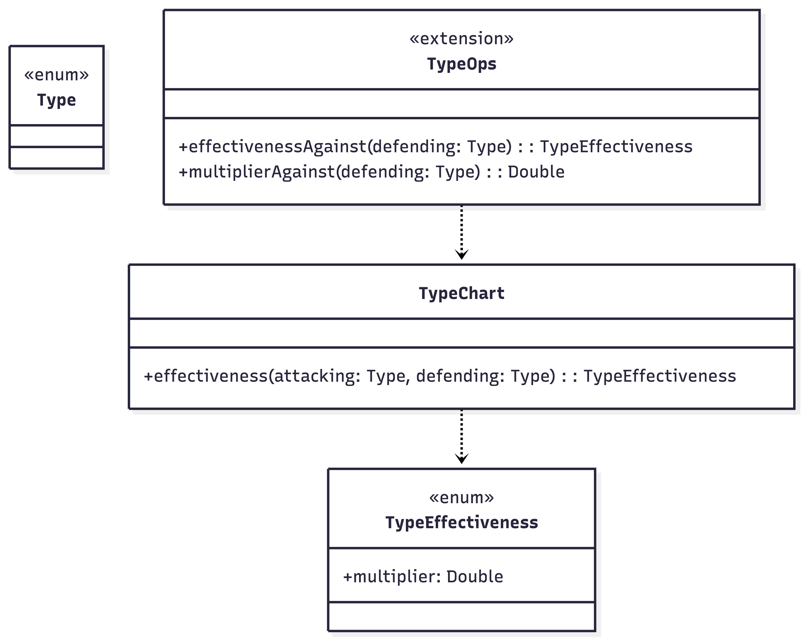
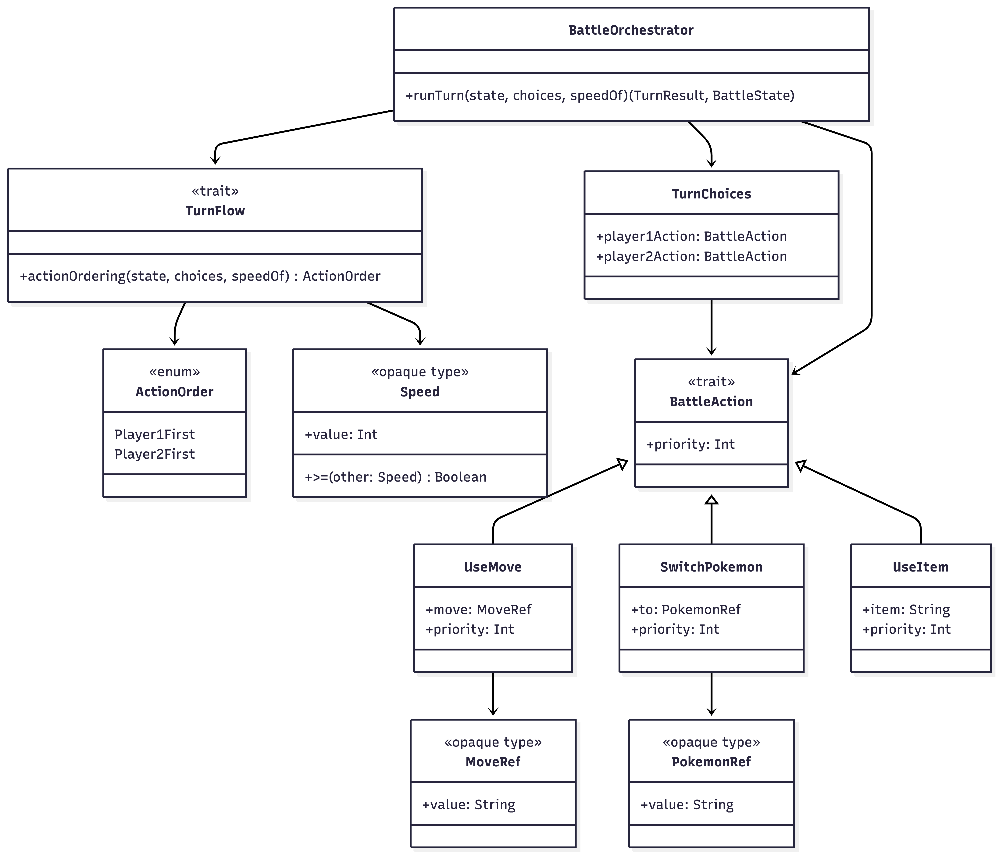
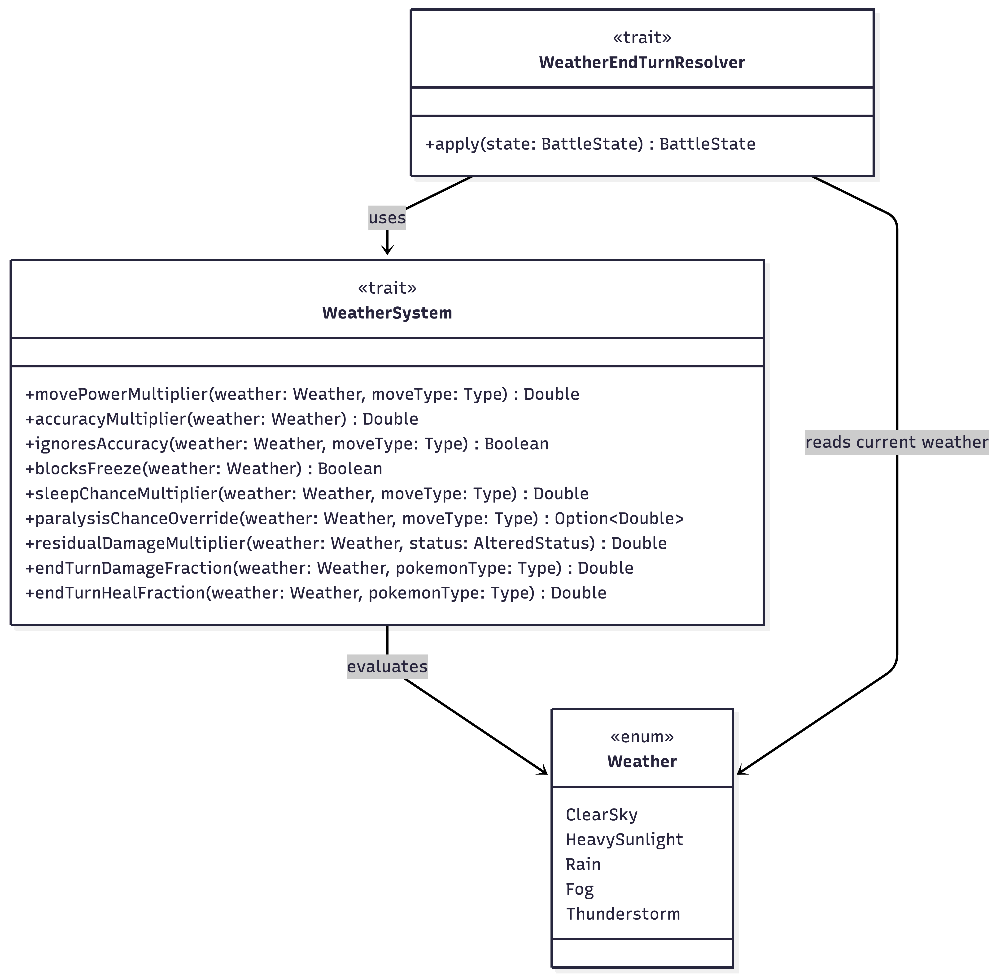

## Saponaro

### Sistema dei tipi

Il sottosistema dei tipi modella sia l’insieme dei tipi elementali sia le regole di
efficacia tra tipo attaccante e tipo difensore. L’implementazione è articolata in
quattro file: `Type`, che definisce i tipi del dominio, `TypeEffectiveness`, che
rappresenta l’esito di un matchup, `TypeChart`, che centralizza la tabella delle
interazioni, e `TypeOps`, che espone un’interfaccia più espressiva tramite extension
methods.

`Type.scala` e `TypeEffectiveness.scala` usano `enum`, scelta adatta a rappresentare
insiemi chiusi e noti a compile-time. In particolare, `TypeEffectiveness` associa a
ogni caso anche il moltiplicatore numerico del danno, così da mantenere insieme
significato semantico e informazione operativa.

In `TypeChart.scala` le interazioni non neutrali sono raccolte in una
`Map[(Type, Type), TypeEffectiveness]`. Questa soluzione segue un approccio *table-driven*,
perché la logica dei matchup non è distribuita in catene di `if` o `match`, ma concentrata
in una struttura dichiarativa unica; inoltre, la piccola DSL interna basata su extension
infisse come `strongAgainst` e `weakAgainst` rende la definizione della tabella più
leggibile e vicina al dominio.

Infine, `TypeOps.scala` aggiunge operazioni di alto livello come `effectivenessAgainst`,
`multiplierAgainst` e i principali predicati booleani sul risultato del confronto. Anche
questa scelta è idiomatica in Scala 3: il comportamento viene esposto tramite extension
methods, mantenendo il modello leggero, leggibile e meno “java-like” rispetto a utility
class statiche o gerarchie di servizio più verbose.

### Gestione dei turni

Il sottosistema dei turni è responsabile di: rappresentazione delle azioni scelte dai
giocatori, calcolo dell’ordine di esecuzione e orchestrazione completa di un
turno di battaglia. L’implementazione è distribuita tra `Speed`, `BattleAction`,
`TurnFlow` e `BattleOrchestrator`, mantenendo separati i concetti di dato, ordinamento e
coordinamento dell’esecuzione.

`Speed.scala` introduce il valore di velocità come `opaque type Speed = Int`, scelta che
permette di mantenere l’efficienza del tipo primitivo ma di distinguere semanticamente
la velocità da un intero generico. Anche `PokemonRef` e `MoveRef`, definiti in
`BattleAction.scala`, seguono lo stesso approccio e forniscono identificatori di dominio
type-safe senza introdurre wrapper runtime superflui.

In `BattleAction.scala` le possibili decisioni del giocatore sono modellate tramite il
trait `BattleAction` e i casi `UseMove`, `SwitchPokemon` e `UseItem`. Ogni azione espone
una `priority`, usata in fase di risoluzione del turno; questa struttura realizza una ADT
aperta via trait più case class, semplice da estendere e adatta a rappresentare in modo
esplicito le scelte disponibili.

Il file `TurnFlow.scala` definisce invece la logica di ordinamento delle azioni.
L’ordine viene deciso prima confrontando la priorità delle azioni selezionate e, in
caso di parità, confrontando la velocità dei Pokémon attivi; il risultato è rappresentato
dall’enum `ActionOrder`, che distingue tra `Player1First` e `Player2First`.

`BattleOrchestrator.scala` coordina infine l’intero ciclo del turno. Il metodo `runTurn`
costruisce una sequenza di `StateTransformer` composta da effetti di inizio turno,
esecuzione ordinata delle azioni e chiusura del turno, applicandola poi allo stato tramite
`foldLeft`; in questo modo il turno viene espresso come pipeline dichiarativa di
trasformazioni pure.

Dal punto di vista progettuale emergono soprattutto tre scelte. La prima è l’uso di
`opaque type` per proteggere identificatori e velocità; la seconda è la modellazione
delle azioni come tipo di dominio esplicito; la terza è l’impiego del pattern
*State Transformer / pipeline*, che consente di descrivere il turno come composizione di
passi indipendenti, evitando una logica monolitica e troppo imperativa.

### Sistema meteo

Il sottosistema del meteo modella le condizioni atmosferiche di battaglia e gli effetti
che queste producono durante l’esecuzione del combattimento. L’implementazione è suddivisa
in tre componenti principali: `Weather`, che rappresenta i possibili stati atmosferici
del dominio, `WeatherSystem`, che definisce l’insieme delle regole associate a ciascuna
condizione, e `WeatherEndTurnResolver`, che applica concretamente gli effetti residui di 
fine turno allo stato della battaglia.

`Weather.scala` rappresenta le condizioni atmosferiche tramite un `enum` chiuso, con i
casi `ClearSky`, `HeavySunlight`, `Rain`, `Fog` e `Thunderstorm`. Questa scelta è coerente
con la natura del dominio, perché il meteo è un insieme finito di condizioni discrete,
facilmente modellabile come ADT e quindi verificabile a compile-time.

`WeatherSystem.scala` concentra invece tutta la logica legata al meteo in un
trait stateless. Le operazioni esposte restituiscono modificatori puri, come
moltiplicatori di potenza e precisione, override probabilistici per alcuni effetti di
stato e frazioni di danno o cura da applicare a fine turno; la default implementation
usa pattern matching su coppie `(weather, type)` o `(weather, status)` per descrivere
in modo dichiarativo le regole del sistema.

Dal punto di vista progettuale, `WeatherSystem` realizza una forma di
*strategy/contextual service*: la logica atmosferica è incapsulata dietro un’interfaccia
astratta ed è fornita tramite `given`, così da poter essere usata come dipendenza
contestuale senza accoppiare il resto del codice a una specifica implementazione
concreta. Questo mantiene il design modulare e ben integrabile con gli altri
sottosistemi del motore di battaglia.

`WeatherEndTurnResolver.scala` si occupa della fase applicativa, cioè della traduzione
delle regole del meteo in modifiche effettive del `BattleState`. Il resolver controlla
se gli effetti atmosferici siano soppressi, applica danno e cura al lato corrente,
ribalta poi la prospettiva con `switchSelfOpponent` per riutilizzare la stessa logica
anche sull’avversario e aggiorna infine il log degli eventi prodotti.

Anche qui emerge chiaramente il pattern *State Transformer* già adottato nel resto del
progetto: il meteo non modifica oggetti in-place, ma produce una nuova versione dello
stato di battaglia a partire da quello corrente. La scelta di riusare la stessa logica
per entrambi i lati mediante inversione di prospettiva evita duplicazione di codice e
rende l’algoritmo più compatto, espressivo e aderente a uno stile funzionale in Scala.

